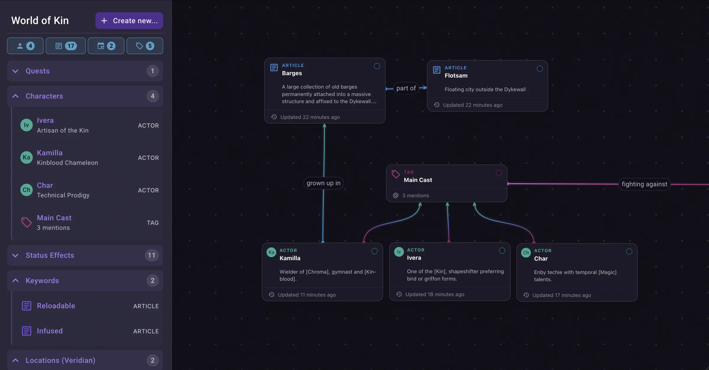

  <a href="https://neverkin.com/">
     
  </a>

# Introduction

Neverkin is an open-source non-commercial collaborative writing and worldbuilding app for storytellers, DMs, writers and novelists. It's great for planning your D&D sessions, writing fanfiction with your friends, keeping track of your thoughts or just when you need to quickly write something down.

**Features:**
- Interactive mindmap
- Rich text editing
- Wiki & character pages
- Relations through @mentions
- Real-time collaboration
- Multi-track timelines
- Custom calendars

## Live Deployments

- **Production**: https://neverkin.com/
  - Manually deployed stable release
- **Staging**: https://staging.neverkin.com/
  - Hot updated directly from the `dev` branch

## Architecture

The application is built using the microservice architecture for Docker Swarm. The following diagram illustrates the main moving parts:

### Frontend (Styx)
- **[React](https://react.dev/)**
- **[TypeScript](https://www.typescriptlang.org/)**
- **[Vite](https://vitejs.dev/)**
- **[TanStack Router](https://tanstack.com/router)**
- **[Redux Toolkit](https://redux-toolkit.js.org/)** + **[RTK Query](https://redux-toolkit.js.org/rtk-query/overview)**
- **[Material UI](https://mui.com/)**
- **[Tiptap](https://tiptap.dev/)**

### Backend (Rhea & Calliope)
- **[Koa.js](https://koajs.com/)**
- **[Prisma ORM](https://www.prisma.io/)**
- **[PostgreSQL](https://www.postgresql.org/)**
- **[Moonflower](https://github.com/tenebrie/moonflower)**
- **[Redis](https://redis.io/)**

### Proxy (Gatekeeper)
- **[Nginx](https://nginx.org/)**

### Infrastructure
- **[Docker](https://www.docker.com/)** + **[Docker Swarm](https://docs.docker.com/engine/swarm/)**
- **[Nginx](https://nginx.org/)**

## Running the app

The development environment requires Node and Docker to run.

In most cases, the following commands are enough to have the entire environment up and running:

- `npm i` <!-- Install dependencies -->
- `npm run dev` <!-- Run dev environment through Docker -->

The migrations are run automatically via a docker-compose task on environment start-up.

The default admin user is `admin@localhost` with password `q`.

### Desktop application

You may download the built desktop application from the [downloads page](https://neverkin.com/download) on the main website, or from the [releases page](https://github.com/Tenebrie/neverkin/releases) here.

### Self-hosting

Please refer to the [self-hosting documentation](https://neverkin.com/docs/self-hosting) for detailed information on setting up your own cluster.

## Technical support

If you encounter trouble, reach out to the developer through the Discord link you can find on the Feedback page in the application. In case of catastrophic data loss, your work can be recovered. However, you are still encouraged to create your own backups.

> A database backup is taken every 6 hours

